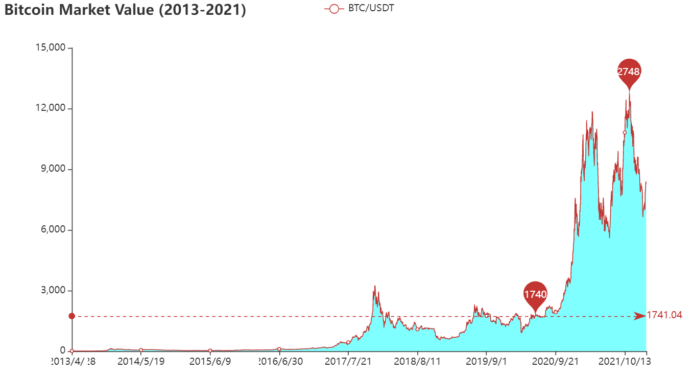
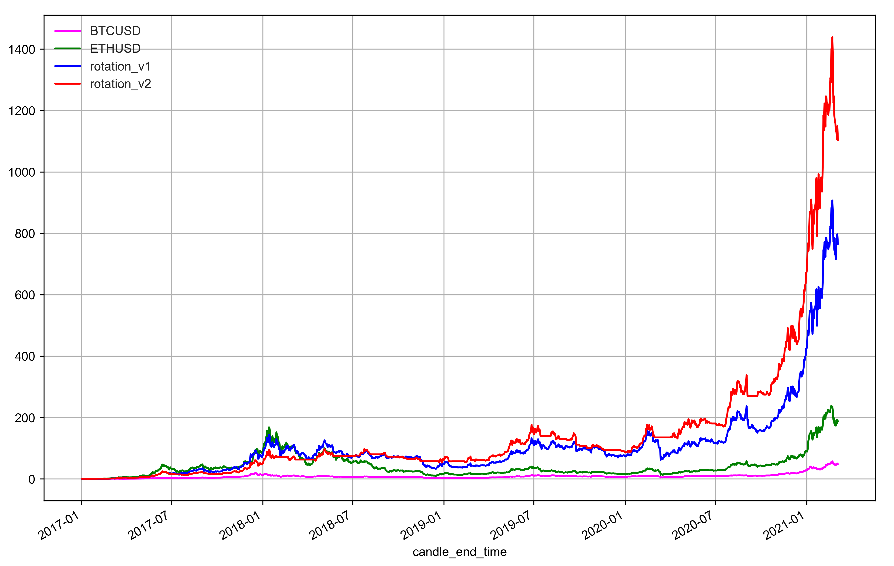

## QTIA-Crypto-Lecture
香港中文大学（深圳）量化投资与交易协会公开讲座资料：区块链与加密货币交易基础

### 代码导航
- `1_btc_mv`：BTC市值走势（亿美元）
- `2_fixed_trading`：定投策略回测
- `3_rotation_trading`：轮动交易策略回测
- `4_timing_trading`：通道突破择时策略回测

### 部分结果 

